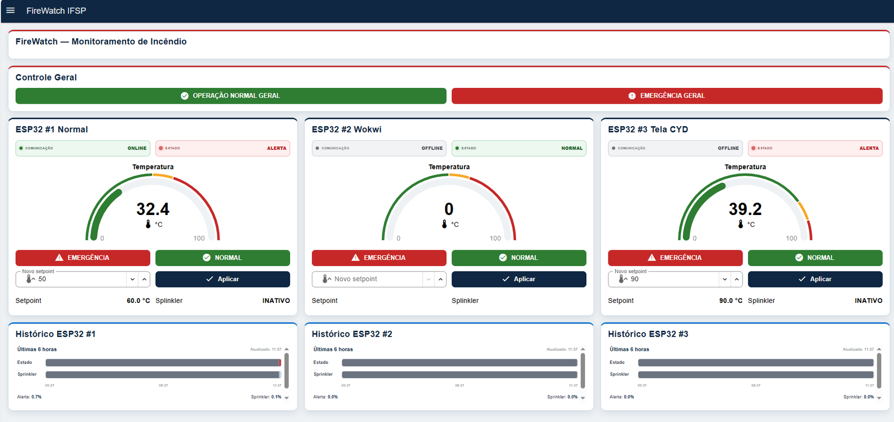
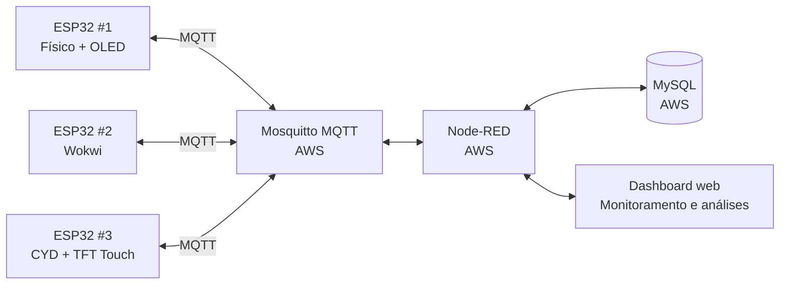
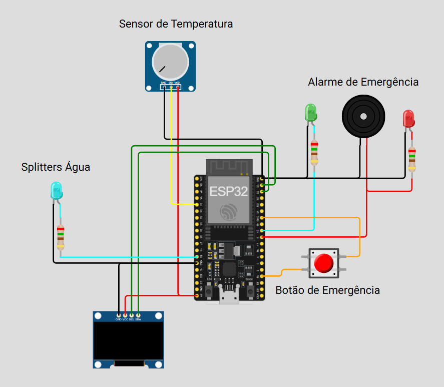
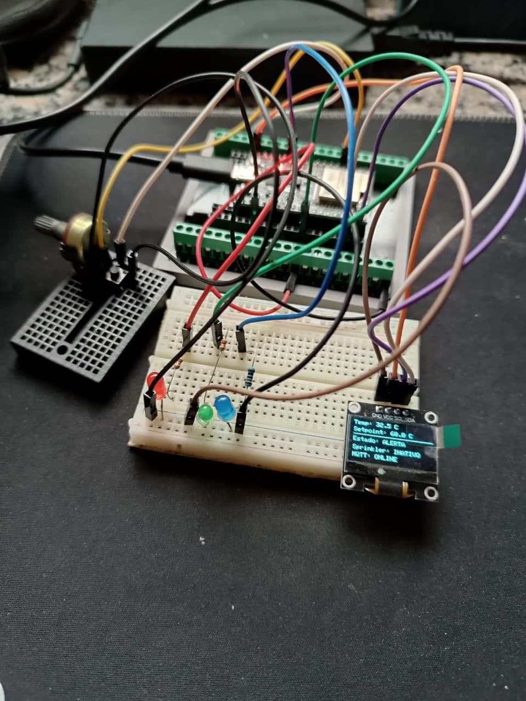
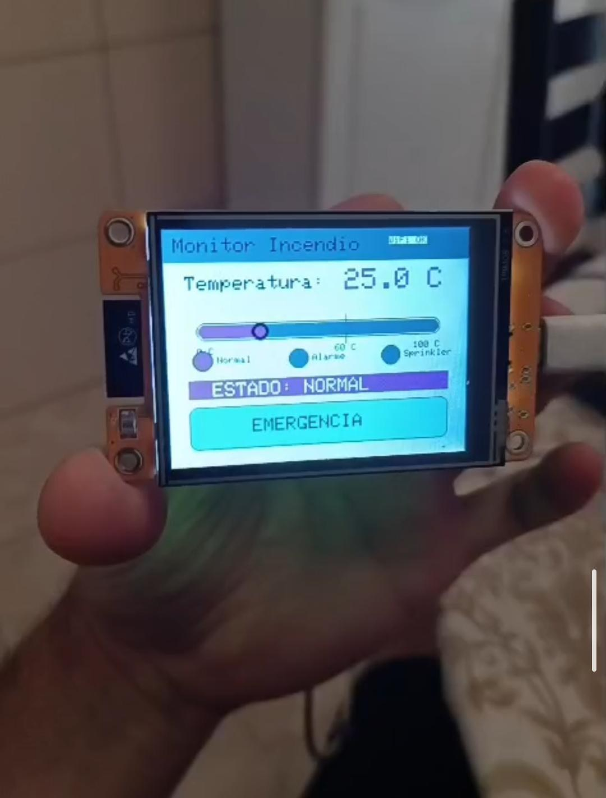
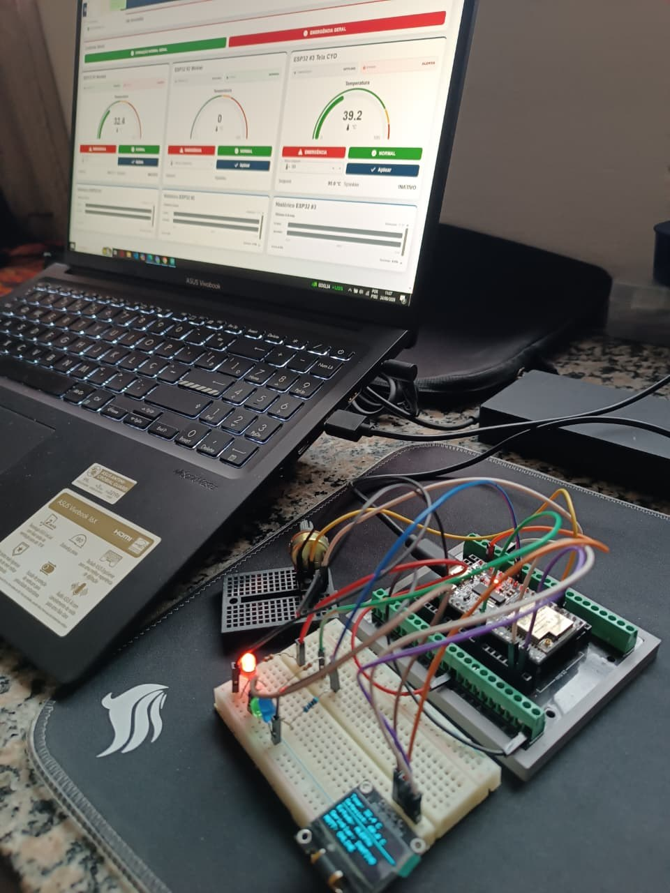

# FireWatch IFSP Catanduva

Sistema embarcado distribuído para **simulação, detecção, alarme e monitoramento de condições de incêndio**, desenvolvido para a disciplina de **Sistemas Embarcados** do curso de **Engenharia de Controle e Automação do Instituto Federal de São Paulo — IFSP, Câmpus Catanduva**.

O projeto integra três dispositivos ESP32, comunicação MQTT, processamento no Node-RED, armazenamento histórico no MySQL e execução dos serviços centrais em uma instância AWS.

> Projeto acadêmico. O protótipo não substitui equipamentos certificados de detecção, alarme ou combate a incêndio.

---

## Links do projeto

| Recurso | Link |
|---|---|
| Simulação no Wokwi | [Abrir projeto no Wokwi](https://wokwi.com/projects/463813280497140737) |
| Dashboard de monitoramento | [Abrir FireWatch no Node-RED](http://firewatchifsp.duckdns.org:1880/dashboard/monitoramento) |
| Página de análises | [Abrir gráficos e filtros históricos](http://firewatchifsp.duckdns.org:1880/dashboard/analises) |
| Instituição | IFSP — Câmpus Catanduva |

> O dashboard depende da instância AWS, do Node-RED, do Mosquitto e do MySQL estarem em execução.

<p align="center">
  <a href="http://firewatchifsp.duckdns.org:1880/dashboard/monitoramento">
    
  </a>
</p>

<p align="center"><sub>Figura 1 — Dashboard de monitoramento do FireWatch.</sub></p>

---

## 1. Descrição do projeto

O FireWatch monitora unidades ESP32 responsáveis por representar pontos de detecção de incêndio. Cada dispositivo transmite temperatura, setpoint, condição de alarme, estado do sprinkler, estado dos LEDs, botão de emergência, intensidade do sinal Wi-Fi e tempo de operação.

A temperatura é simulada de duas formas:

- por um **potenciômetro**, nos ESP32 convencionais;
- por um **slider touch**, no ESP32 CYD.

O valor simulado varia entre **0 °C e 100 °C**. O setpoint inicial definido no firmware é **60 °C**, podendo ser alterado remotamente pelo dashboard.

O sistema possui três dispositivos lógicos:

| Dispositivo | Implementação | Identificador |
|---|---|---|
| ESP32 #1 | Protótipo físico com OLED | `esp32-01` |
| ESP32 #2 | Simulação no Wokwi | `esp32-02` |
| ESP32 #3 | ESP32 CYD com display TFT touch | `esp32-03` |

---

## 2. Objetivos

- aplicar conceitos de sistemas embarcados e Internet das Coisas;
- integrar dispositivos físicos e simulados;
- utilizar MQTT para telemetria e comandos;
- utilizar Node-RED como sistema de integração e supervisão;
- registrar todas as leituras no MySQL;
- visualizar estados atuais e históricos;
- permitir alteração remota do setpoint;
- permitir acionamento e normalização de emergências;
- identificar dispositivos online e offline;
- executar a infraestrutura em uma instância AWS.

---

## 3. Arquitetura



Os serviços Mosquitto, Node-RED e MySQL são executados na mesma instância AWS. Por isso, o fluxo utiliza:

```text
Broker MQTT: 127.0.0.1:1883
MySQL:        127.0.0.1:3306
```

Os ESP32 acessam o broker pelo domínio:

```text
firewatchifsp.duckdns.org:1883
```

---

## 4. Funcionamento do sistema

### 4.1 Temperatura simulada

No ESP32 convencional, o ADC lê o potenciômetro com resolução de 0 a 4095 e converte o valor para uma temperatura de 0 °C a 100 °C:

```text
temperatura = leitura_ADC / 4095 × 100
```

No ESP32 CYD, a temperatura é ajustada pelo slider da interface touch.

### 4.2 Condição de sprinkler

O sprinkler depende exclusivamente da temperatura:

```text
temperatura > setpoint  → sprinkler ativo
temperatura ≤ setpoint  → sprinkler inativo
```

O botão de emergência e o comando remoto ativam o alarme, mas não ativam diretamente o sprinkler.

### 4.3 Condição de alarme

O alarme pode ser ativado por:

- temperatura acima do setpoint;
- botão físico de emergência;
- botão touch do ESP32 CYD;
- comando MQTT enviado pelo dashboard;
- comando geral destinado a todos os dispositivos.

Após ativado, o alarme permanece retido até receber o comando de reset. O reset não é aceito enquanto a temperatura continuar acima do setpoint.

### 4.4 Sinalização física dos LEDs

No protótipo físico convencional, os LEDs possuem as seguintes funções:

| LED | Comportamento | Significado |
|---|---|---|
| Verde | Aceso continuamente | Sistema em modo normal |
| Vermelho | Pisca a cada 500 ms | Alerta de incêndio ativo |
| Azul | Aceso continuamente | Sprinkler ativado |

O LED verde é desligado durante o alerta. O LED vermelho acompanha o estado de alarme e o LED azul depende exclusivamente da condição de sprinkler.

O buzzer utiliza a mesma sinalização intermitente do alerta de incêndio.

### 4.5 Estados importantes

| Situação | Alarme | Sprinkler |
|---|---:|---:|
| Temperatura abaixo do setpoint | Inativo | Inativo |
| Botão de emergência pressionado | Ativo | Depende da temperatura |
| Emergência enviada pelo dashboard | Ativo | Depende da temperatura |
| Temperatura acima do setpoint | Ativo | Ativo |
| Temperatura reduzida após alerta térmico | Permanece ativo até reset | Inativo |
| Reset com temperatura acima do setpoint | Permanece ativo | Ativo |
| Reset com temperatura abaixo do setpoint | Inativo | Inativo |

---

## 5. Montagens e interfaces

### 5.1 Esquemático no Wokwi

O circuito simulado utiliza ESP32, potenciômetro, botão de emergência, LEDs, buzzer, display OLED e saída representativa do sprinkler.

<p align="center">
  <a href="https://wokwi.com/projects/463813280497140737">
    
  </a>
</p>

<p align="center"><sub>Figura 2 — Esquemático do ESP32 simulado no Wokwi.</sub></p>

### 5.2 Montagem física

<p align="center">
  
</p>

<p align="center"><sub>Figura 3 — Protótipo físico com ESP32, potenciômetro, LEDs e display OLED.</sub></p>

O OLED apresenta:

- temperatura atual;
- setpoint;
- estado normal ou alerta;
- estado do sprinkler;
- estado da conexão MQTT.

### 5.3 ESP32 CYD

<p align="center">
  
</p>

<p align="center"><sub>Figura 4 — Interface gráfica local executada no ESP32 CYD.</sub></p>

A interface do CYD possui:

- temperatura simulada;
- slider de ajuste;
- indicação visual das faixas normal, alarme e sprinkler;
- estado geral do sistema;
- botão touch de emergência;
- informação de conexão.

### 5.4 Integração com o dashboard

<p align="center">
  
</p>

<p align="center"><sub>Figura 5 — Operação integrada entre protótipo físico e dashboard.</sub></p>

---

## 6. Pinagem do ESP32 convencional

| Componente | GPIO |
|---|---:|
| Potenciômetro | 34 |
| Botão de emergência | 15 |
| LED verde | 18 |
| LED vermelho de alarme | 5 |
| LED azul do sprinkler | 12 |
| OLED SDA | 22 |
| OLED SCL | 23 |
| Endereço OLED | `0x3C` |

---

## 7. Pinagem principal do ESP32 CYD

| Função | GPIO |
|---|---:|
| LED RGB vermelho | 4 |
| LED RGB verde | 16 |
| LED RGB azul | 17 |
| Botão BOOT | 0 |
| Touch IRQ | 36 |
| Touch MOSI | 32 |
| Touch MISO | 39 |
| Touch CLK | 25 |
| Touch CS | 33 |

O display possui resolução de 320 × 240 pixels e utiliza as bibliotecas `TFT_eSPI` e `XPT2046_Touchscreen`.

---

## 8. Comunicação MQTT

### 8.1 Tópicos

| Finalidade | Tópico |
|---|---|
| Telemetria | `ESP32/<device_id>/status` |
| Disponibilidade | `ESP32/<device_id>/availability` |
| Comando individual | `ESP32/<device_id>/command` |
| Comando geral | `ESP32/all/command` |

Exemplos:

```text
ESP32/esp32-01/status
ESP32/esp32-02/availability
ESP32/esp32-03/command
ESP32/all/command
```

### 8.2 Telemetria

Exemplo de mensagem publicada pelo ESP32:

```json
{
  "device_id": "esp32-01",
  "button": 0,
  "temperature": 32.4,
  "threshold": 60.0,
  "setpoint": 60.0,
  "temperature_above_setpoint": 0,
  "alarm": 0,
  "sprinkler": 0,
  "led_green": 1,
  "led_alarm": 0,
  "state": "normal",
  "wifi_rssi": -61,
  "uptime_ms": 528000
}
```

A telemetria é publicada como mensagem retida. Assim, o Node-RED recebe o último estado conhecido quando se conecta ao broker.

### 8.3 Comandos

Acionar emergência:

```json
{
  "command": "alarm",
  "value": 1
}
```

Normalizar:

```json
{
  "command": "reset",
  "value": 1
}
```

Alterar setpoint:

```json
{
  "command": "setpoint",
  "value": 65
}
```

### 8.4 Disponibilidade

Os dispositivos utilizam MQTT Last Will and Testament:

```text
online  → publicado após a conexão
offline → publicado pelo broker se a conexão cair inesperadamente
```

As mensagens de disponibilidade são retidas.

---

## 9. Node-RED

O arquivo completo está disponível em:

```text
node-red/flows.json
```

O Node-RED realiza:

- recepção dos tópicos `ESP32/+/status`;
- conversão das mensagens JSON;
- validação dos campos;
- inserção parametrizada no MySQL;
- separação das informações por dispositivo;
- atualização dos gauges e indicadores;
- controle online/offline;
- envio de comandos MQTT;
- configuração individual ou geral de setpoint;
- acionamento de emergência;
- normalização dos dispositivos;
- geração dos históricos das últimas 6 horas;
- consulta histórica por dispositivo e período;
- cálculo de indicadores;
- preparação das séries de temperatura e setpoint.

### 9.1 Página de monitoramento

Endereço:

[http://firewatchifsp.duckdns.org:1880/dashboard/monitoramento](http://firewatchifsp.duckdns.org:1880/dashboard/monitoramento)

A página apresenta:

- conexão online/offline;
- estado normal ou alerta;
- temperatura atual;
- setpoint atual;
- estado do sprinkler;
- comando de emergência;
- comando de normalização;
- alteração de setpoint;
- histórico operacional das últimas 6 horas;
- períodos sem dados;
- percentual de tempo em alerta;
- percentual de tempo com sprinkler ativo.

### 9.2 Página de análises

Endereço:

[http://firewatchifsp.duckdns.org:1880/dashboard/analises](http://firewatchifsp.duckdns.org:1880/dashboard/analises)

A página apresenta:

- filtro por todos os dispositivos ou por dispositivo individual;
- data inicial;
- hora inicial;
- data final;
- hora final;
- gráfico histórico de temperatura;
- linha de setpoint de cada dispositivo;
- temperatura mínima;
- temperatura média;
- temperatura máxima;
- percentual de alerta;
- quantidade de registros;
- tabela com os registros mais recentes do período.

Quando as datas não são informadas, o fluxo utiliza as últimas 48 horas como período padrão.

---

## 10. Banco de dados MySQL

O banco utilizado pelo fluxo é:

```text
iot_incendio
```

A tabela principal é:

```text
leituras_esp32
```

Cada publicação registra:

- dispositivo;
- tópico MQTT;
- temperatura;
- setpoint;
- condição acima do setpoint;
- botão;
- alarme;
- sprinkler;
- LED verde;
- LED de alarme;
- estado;
- RSSI;
- uptime;
- data e hora de recebimento.

O script de criação está em:

```text
database/schema.sql
```

Execução:

```bash
mysql -u root -p < database/schema.sql
```

O fluxo utiliza consultas parametrizadas para reduzir erros de formatação e evitar a concatenação direta dos valores recebidos.

### Exemplo de consulta histórica

```sql
SELECT
    device_id,
    temperatura,
    setpoint,
    alarme,
    sprinkler,
    recebido_em
FROM leituras_esp32
WHERE device_id = 'esp32-01'
  AND recebido_em BETWEEN
      '2026-06-24 08:00:00'
      AND
      '2026-06-24 18:00:00'
ORDER BY recebido_em ASC;
```

---

## 11. Infraestrutura AWS

Os serviços centrais são executados em uma instância AWS:

| Serviço | Função |
|---|---|
| Mosquitto | Broker MQTT |
| Node-RED | Processamento, supervisão e comandos |
| MySQL | Armazenamento das leituras |
| DuckDNS | Nome de domínio para acesso externo |
| AWS EC2 | Hospedagem da solução |

### Portas utilizadas

| Porta | Serviço | Exposição recomendada |
|---:|---|---|
| 22 | SSH | Somente IPs administrativos |
| 1880 | Node-RED e dashboard | Restringir ou proteger com HTTPS |
| 1883 | MQTT | Autenticação e restrição de origem |
| 3306 | MySQL | Não expor publicamente |

O MySQL e o Mosquitto são acessados pelo Node-RED em `127.0.0.1`, pois estão instalados na mesma instância.

---

## 12. Instalação na instância AWS

Exemplo para uma distribuição baseada em Ubuntu:

```bash
sudo apt update
sudo apt install -y mosquitto mosquitto-clients mysql-server
sudo systemctl enable --now mosquitto
sudo systemctl enable --now mysql
```

Instalação do Node-RED:

```bash
sudo npm install -g --unsafe-perm node-red
```

Instalação dos nós adicionais:

```bash
cd ~/.node-red
npm install @flowfuse/node-red-dashboard node-red-node-mysql
```

Inicialização:

```bash
node-red
```

Para operação permanente, recomenda-se configurar o Node-RED como serviço do sistema.

---

## 13. Importação do fluxo

1. Abrir o editor do Node-RED.
2. Acessar **Menu → Import → Clipboard**.
3. Copiar o conteúdo de `node-red/flows.json`.
4. Confirmar a importação.
5. Abrir o nó de configuração `MySQL AWS Local`.
6. Informar usuário e senha do MySQL.
7. Confirmar o broker `Mosquitto AWS Local` em `127.0.0.1:1883`.
8. Clicar em **Deploy**.
9. Verificar o painel de depuração.
10. Abrir o dashboard.

As credenciais do banco não são incluídas no repositório.

---

## 14. Configuração dos firmwares

### 14.1 ESP32 físico

Arquivo:

```text
firmware/esp32-fisico/ESP32Fisico.ino
```

Alterar:

```cpp
const char* WIFI_SSID = "SUA_REDE_WIFI";
const char* WIFI_PASSWORD = "SUA_SENHA_WIFI";
```

Identificador:

```cpp
const char* DEVICE_ID = "esp32-01";
```

### 14.2 ESP32 no Wokwi

Arquivo:

```text
firmware/esp32-wokwi/ESP32Wokwi.ino
```

O simulador utiliza:

```cpp
const char* WIFI_SSID = "Wokwi-GUEST";
const char* WIFI_PASSWORD = "";
const char* DEVICE_ID = "esp32-02";
```

Projeto:

[https://wokwi.com/projects/463813280497140737](https://wokwi.com/projects/463813280497140737)

### 14.3 ESP32 CYD

Arquivo:

```text
firmware/esp32-cyd/ESP32CYD.ino
```

Alterar as credenciais Wi-Fi antes da gravação.

Identificador:

```cpp
const char* DEVICE_ID = "esp32-03";
```

---

## 15. Bibliotecas Arduino

### ESP32 convencional e Wokwi

- `WiFi`;
- `PubSubClient`;
- `ArduinoJson`;
- `Wire`;
- `Adafruit GFX Library`;
- `Adafruit SSD1306`.

### ESP32 CYD

- `WiFi`;
- `PubSubClient`;
- `ArduinoJson`;
- `SPI`;
- `TFT_eSPI`;
- `XPT2046_Touchscreen`.

A biblioteca `TFT_eSPI` deve estar configurada para o modelo de display utilizado pelo CYD.

---

## 16. Estrutura do repositório

```text
FireWatch-IFSP-Catanduva/
├── README.md
├── .gitignore
├── database/
│   ├── schema.sql
│   └── queries.sql
├── docs/
│   └── images/
│       ├── dashboard-monitoramento.png
│       ├── esp32-cyd-interface.jpg
│       ├── integracao-dashboard.jpg
│       ├── montagem-fisica.jpg
│       └── wokwi-esquematico.png
├── firmware/
│   ├── README.md
│   ├── esp32-cyd/
│   │   └── ESP32CYD.ino
│   ├── esp32-fisico/
│   │   └── ESP32Fisico.ino
│   └── esp32-wokwi/
│       └── ESP32Wokwi.ino
└── node-red/
    ├── README.md
    └── flows.json
```

---

## 17. Testes recomendados

### Operação normal

1. Manter a temperatura abaixo do setpoint.
2. Confirmar LED verde aceso.
3. Confirmar LED vermelho desligado.
4. Confirmar LED azul desligado.
5. Confirmar estado normal no dashboard.

### Alerta térmico

1. Aumentar a temperatura acima do setpoint.
2. Confirmar LED vermelho piscando.
3. Confirmar LED azul aceso.
4. Confirmar sprinkler ativo.
5. Confirmar registro no MySQL.

### Botão de emergência

1. Manter a temperatura abaixo do setpoint.
2. Pressionar o botão.
3. Confirmar o alarme.
4. Confirmar que o sprinkler permanece inativo.
5. Confirmar o evento no dashboard.

### Comando remoto

1. Selecionar o dispositivo.
2. Acionar a emergência.
3. Verificar o tópico MQTT.
4. Confirmar a resposta do ESP32.
5. Normalizar o sistema.

### Dispositivo offline

1. Desligar um ESP32.
2. Aguardar a mensagem Last Will.
3. Confirmar estado offline.
4. Religar o dispositivo.
5. Confirmar retorno para online.

### Histórico

1. Abrir a página de análises.
2. Selecionar o dispositivo.
3. Informar data e hora inicial.
4. Informar data e hora final.
5. Executar a pesquisa.
6. Conferir temperatura, setpoint, alertas e registros.

---

## 18. Segurança

Antes de manter o sistema acessível externamente:

- ativar usuário e senha no Mosquitto;
- proteger o editor do Node-RED;
- utilizar HTTPS por meio de proxy reverso;
- restringir as regras do Security Group;
- manter a porta 3306 fechada para a internet;
- utilizar senhas diferentes para cada serviço;
- não versionar credenciais;
- realizar backups do MySQL;
- atualizar periodicamente a instância.

---

## 19. Instituição

**Instituto Federal de Educação, Ciência e Tecnologia de São Paulo — IFSP**  
**Câmpus Catanduva**  
**Curso:** Engenharia de Controle e Automação  
**Disciplina:** Sistemas Embarcados  
**Projeto:** FireWatch — Sistema de Detecção e Monitoramento de Incêndio  
**Ano:** 2026
